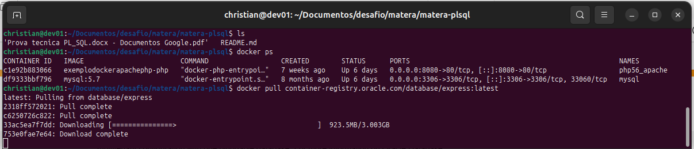
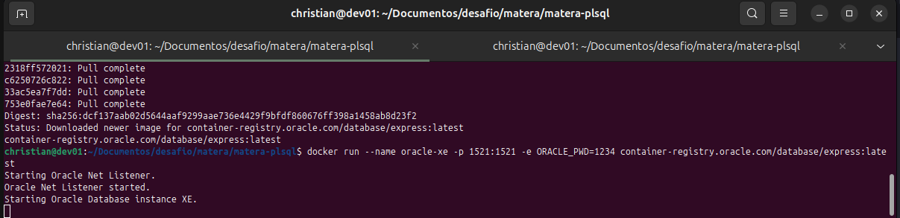
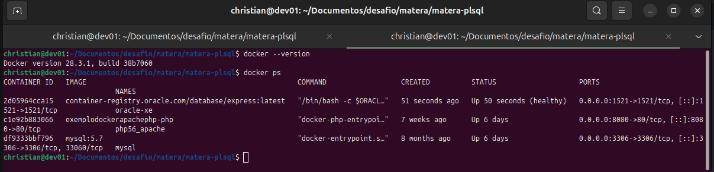
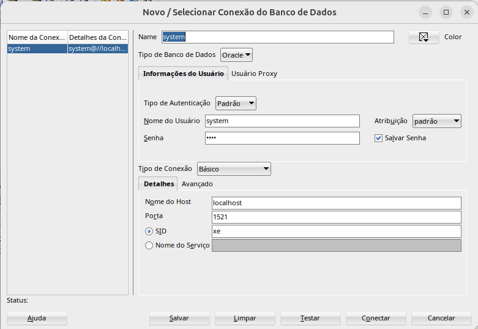

# matera-plsql
Exercícios para Analista de Desenvolvimento de Sistemas (Foco em PL/SQL)‬

Essa é a prova de seleção prática para Analista de Desenvolvimento de Sistemas com foco em PL/SQL

O objetivo da dessa prova esta descrito no arquivo Prova tecnica...pdf

Segue abaixo os passos para a resolução:

## 1 - Montar o ambiente (estou partindo do principio que ja esteja instalado o docker)
    
    Docker Instalado
    
### Baixar a image do OracleXE
**docker pull container-registry.oracle.com/database/express:latest**
    
    Processo de baixar a image OracleXE

### Rodar a imagem docker
**docker run --name oracle-xe -p 1521:1521 -e ORACLE_PWD=1234 container-registry.oracle.com/database/express:latest**
    
    Docker run da image OracleXE
    
    Confirmando que a image esta rodando

### Conectando servidor (utilizei o SQL Developer)

Conectando ao banco (SID **xe**) lembrando de colocar o usuario **system** e senha **1234**
### Criando as Tabelas
```
CREATE TABLE APOSTAS_TEMP (
	APOSTA_ID INTEGER NOT NULL,
	USUARIO_ID INTEGER NOT NULL,
	VALOR DECIMAL(10,2) NOT NULL,
	DATA_APOSTA DATE NOT NULL,
	CONSTRAINT APOSTAS_TEMP_PK PRIMARY KEY (APOSTA_ID));

CREATE TABLE APOSTAS_FINAL (
	APOSTA_ID INTEGER NOT NULL,
	USUARIO_ID INTEGER NOT NULL,
	VALOR DECIMAL(10,2) NOT NULL,
	DATA_APOSTA DATE NOT NULL,
	CONSTRAINT APOSTAS_FINAL_PK PRIMARY KEY (APOSTA_ID));

```
#### Resposta do Exercicio 1
Segue abaixo a sugestão de solução, dessa forma garante a não duplicidade que poderia ocorrer no cenario anterior
```
create or replace PROCEDURE PROCESSA_APOSTAS IS 
BEGIN
  DBMS_OUTPUT.PUT_LINE('Início do processamento das apostas.');
  INSERT INTO APOSTAS_FINAL (SELECT * FROM APOSTAS_TEMP WHERE VALOR > 0 AND DATA_APOSTA IS NOT NULL
    AND NOT APOSTA_ID IN (SELECT APOSTA_ID FROM APOSTAS_FINAL));
  DBMS_OUTPUT.PUT_LINE('Fim do processamento das apostas');
  EXCEPTION
  WHEN OTHERS THEN
  ROLLBACK;
  DBMS_OUTPUT.PUT_LINE('Erro ao processar as apostas' || SQLERRM);
END PROCESSA_APOSTAS;
```
#### Resposta do Exercicio 2
Para solução precisou criar 2 Sequences, 1 Tabela (Apostadores), 2 Trigger para o autoincremento dos Apostadores e das Apostas_temp e a procedure solicitada, segue abaixo:
```
CREATE SEQUENCE apostas_seq
  MINVALUE 1
  MAXVALUE 999999999999999999999999999
  START WITH 1
  INCREMENT BY 1
  CACHE 20;

CREATE SEQUENCE apostadores_seq
  MINVALUE 1
  MAXVALUE 999999999999999999999999999
  START WITH 1
  INCREMENT BY 1
  CACHE 20;

CREATE TABLE APOSTADORES (
	APOSTADOR_ID INTEGER NOT NULL,
	NOME VARCHAR2(250) NOT NULL,
	IDADE INTEGER NOT NULL,
	EMAIL VARCHAR2(250) NOT NULL,
	CONSTRAINT APOSTADORES_PK PRIMARY KEY (APOSTADOR_ID));

CREATE OR REPLACE TRIGGER APOSTADORES_ON_INSERT
  BEFORE INSERT ON APOSTADORES
  FOR EACH ROW
BEGIN
  SELECT APOSTADORES_SEQ.nextval
  INTO :new.APOSTADOR_ID
  FROM dual;
END;

CREATE OR REPLACE TRIGGER APOSTAS_TEMP_ON_INSERT
  BEFORE INSERT ON APOSTAS_TEMP
  FOR EACH ROW
BEGIN
  SELECT APOSTAS_SEQ.nextval
  INTO :new.APOSTA_ID
  FROM dual;
END;

create or replace PROCEDURE CADASTRAR_APOSTADOR( NOME_APOSTADOR IN VARCHAR2, IDADE_APOSTADOR IN INTEGER, EMAIL_APOSTADOR IN VARCHAR2
, VALOR_APOSTA IN DECIMAL) AS 
 QTD_APOSTADOR INTEGER;
 APOSTADORID INTEGER;
BEGIN
  DBMS_OUTPUT.PUT_LINE('Início do cadastramento do Apostador.');
  SELECT COUNT(*) INTO QTD_APOSTADOR FROM APOSTADORES WHERE EMAIL = EMAIL_APOSTADOR;
  IF (IDADE_APOSTADOR < 18) THEN
    DBMS_OUTPUT.PUT_LINE('Apostador menor de idade');
    ROLLBACK;
  ELSIF (QTD_APOSTADOR > 0) THEN
    DBMS_OUTPUT.PUT_LINE('Email de apostador ja cadastrado');
    ROLLBACK;
  ELSE 
    SELECT APOSTADORES_SEQ.nextval INTO APOSTADORID FROM dual;
    INSERT INTO APOSTADORES (APOSTADOR_ID, NOME, IDADE, EMAIL) 
    VALUES (APOSTADORID, NOME_APOSTADOR, IDADE_APOSTADOR, EMAIL_APOSTADOR);
        
    INSERT INTO APOSTAS_TEMP (APOSTA_ID, USUARIO_ID, VALOR, DATA_APOSTA) VALUES (APOSTAS_SEQ.nextval, APOSTADORID, VALOR_APOSTA, SYSDATE); 
    
    
  END IF;
  DBMS_OUTPUT.PUT_LINE('Fim do cadastro do apostador');
  EXCEPTION
  WHEN OTHERS THEN
  ROLLBACK;
  DBMS_OUTPUT.PUT_LINE('Erro ao cadastrar apostador' || SQLERRM);
  PROCESSA_APOSTAS;    
END CADASTRAR_APOSTADOR;
```
#### Resposta do Exercicio 3
Para essa tarefa tenho que criar as tabelas primeiro
```
CREATE TABLE TIMES (
	TIMES_ID INTEGER NOT NULL,
	NOME VARCHAR2(100),
	PONTOS INTEGER ,
	CONSTRAINT TIMES_PK PRIMARY KEY (TIMES_ID));

CREATE TABLE PARTIDAS (
	PARTIDAS_ID INTEGER NOT NULL,
	NOME VARCHAR2(100),
    DATA_HORA TIMESTAMP,
    ID_TIME1 INTEGER,
    ID_TIME2 INTEGER,
    FOREIGN KEY (ID_TIME1) REFERENCES TIMES(TIMES_ID),
    FOREIGN KEY (ID_TIME2) REFERENCES TIMES(TIMES_ID),
	CONSTRAINT PARTIDAS_PK PRIMARY KEY (PARTIDAS_ID));

CREATE TABLE APOSTAS (
	APOSTAS_ID INTEGER NOT NULL,
	ID_PARTIDA INTEGER,
    ID_TIME INTEGER,
    VALOR_APOSTA DECIMAL(10,2),
    ID_TIME2 INTEGER,
    FOREIGN KEY (ID_PARTIDA) REFERENCES PARTIDAS(PARTIDAS_ID),
    FOREIGN KEY (ID_TIME) REFERENCES TIMES(TIMES_ID),
	CONSTRAINT APOSTAS_PK PRIMARY KEY (APOSTAS_ID));

```
Solução proposta para o exercicio 3
Criei a variavel **V_APOSTAS_ID** que vai receber o valor de **APOSTAS_ID** que foi incluido para retornar no cursor **cur_apostas** , assim posso garantir que somente a aposta correta vai ser atualizada o valor
```
create or replace PROCEDURE ATUALIZAR_VALORES_APOSTA IS 
V_ID_PARTIDA partidas.partidas_id%type;
V_ID_TIME apostas.id_time%type;
V_DATA_HORA TIMESTAMP;
V_VALOR_APOSTA apostas.valor_aposta%type;
V_PONTOS INTEGER;
V_TEMPO_RESTANTE INTERVAL DAY TO SECOND;
V_FATOR_TEMPO NUMBER := 1.5;
V_FATOR_PONTOS NUMBER := 2.0;
V_APOSTAS_ID apostas.apostas_id%type;
CURSOR cur_apostas IS
    SELECT a.apostas_id, a.id_partida, a.id_time, a.valor_aposta, p.data_hora FROM APOSTAS a JOIN PARTIDAS p ON a.id_partida = p.partidas_id;
    
BEGIN
    FOR rec IN cur_apostas LOOP
        V_APOSTAS_ID := rec.apostas_id;
        V_ID_PARTIDA := rec.id_partida;
        V_ID_TIME := rec.id_time;
        V_VALOR_APOSTA := rec.valor_aposta;
        V_DATA_HORA := rec.data_hora;
        SELECT PONTOS INTO V_PONTOS FROM TIMES WHERE TIMES_ID = V_ID_TIME;
        V_TEMPO_RESTANTE := V_DATA_HORA - SYSTIMESTAMP;
        IF V_TEMPO_RESTANTE < INTERVAL '1' HOUR THEN
            V_VALOR_APOSTA := V_FATOR_TEMPO * (1 + V_PONTOS / 100);
            UPDATE APOSTAS SET VALOR_APOSTA = V_VALOR_APOSTA WHERE APOSTAS_ID = V_APOSTAS_ID;
        END IF;
    END LOOP;
    COMMIT;
    EXCEPTION
    WHEN OTHERS THEN
    ROLLBACK;
    RAISE;
END ATUALIZAR_VALORES_APOSTA;
```

##### Para Testar 
```
EXEC PROCESSA_APOSTAS;

SELECT * FROM APOSTAS_FINAL
```


