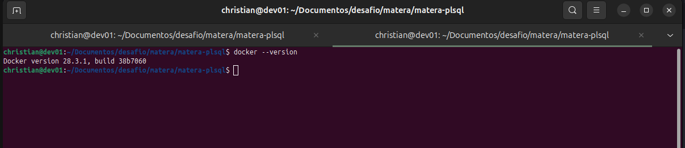

# matera-plsql
Exercícios para Analista de Desenvolvimento de Sistemas (Foco em PL/SQL)‬

Essa é a prova de seleção prática para Analista de Desenvolvimento de Sistemas com foco em PL/SQL

O objetivo da dessa prova esta descrito no arquivo Prova tecnica...pdf

Segue abaixo os passos para a resolução:

1 - Montar o ambiente (estou partindo do principio que ja esteja instalado o docker)
    

